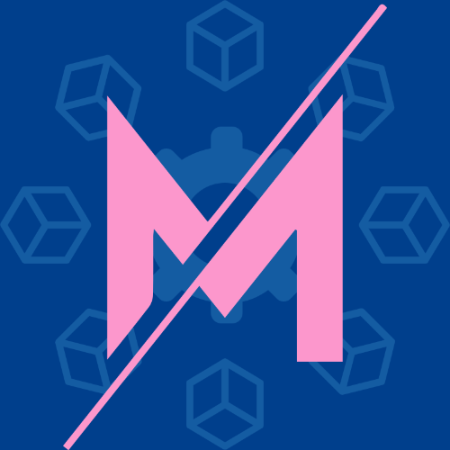

 

  

  <h3 align="center">Mix Architecture</h3>

    Blend the best patterns and architectural solutions, be the best of the best!
     
     
    <a href="https://mixarchitecture.github.io"><strong>Explore the docs »</strong></a>
     
  

## About The Project

Mix Architecture is a set of patterns and architectural solutions that can be used in any project, regardless of the technology used. The idea is to have a set of patterns that can be used in any project, regardless of the technology used.

## Roadmap

This project using GitHub Projects to manage the roadmap. You can view all projects by [clicking here](https://github.com/orgs/mixarchitecture/projects/2).

## Contributing

Contributions are what make the open source community such an amazing place to be learn, inspire, and create. Any contributions you make are **greatly appreciated**.

- If you have suggestions for adding or removing projects, feel free to open an issue to discuss it, or directly create a pull request after you edit the README.md file with necessary changes.
- Please make sure you check your spelling and grammar.
- Create individual PR for each suggestion.
- Please also read through the [Code Of Conduct]() before posting your first idea as well.

##  Creating a Pull Request

1. Fork the Project
2. Create your Feature Branch (`git checkout -b feature/AmazingFeature`)
3. Commit your Changes (`git commit -m 'feat #{issue-number}: Add some AmazingFeature'`)
4. Push to the Branch (`git push origin feature/AmazingFeature`)
5. Open a Pull Request

## License

Distributed under the MIT License. See `LICENSE` for more information.

## Contributors

- **Sami Salih İbrahimbaş** - *Initial work* - [ssibrahimbas](https://github.com/ssibrahimbas).
